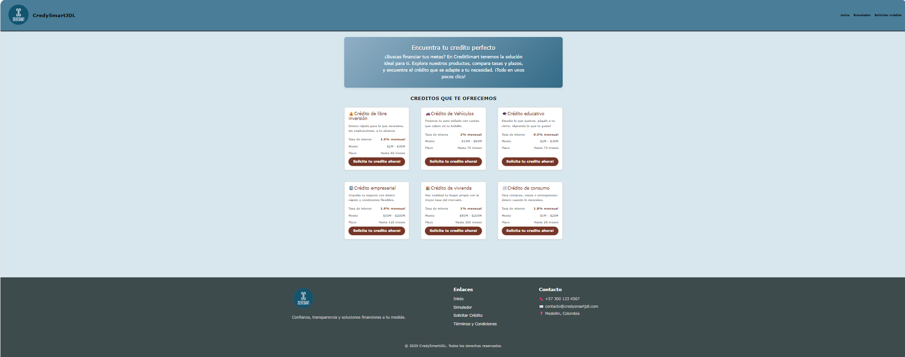
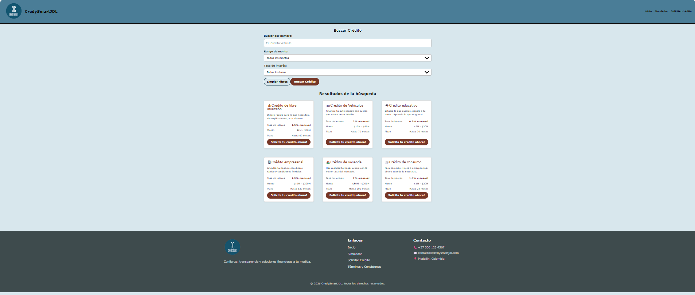
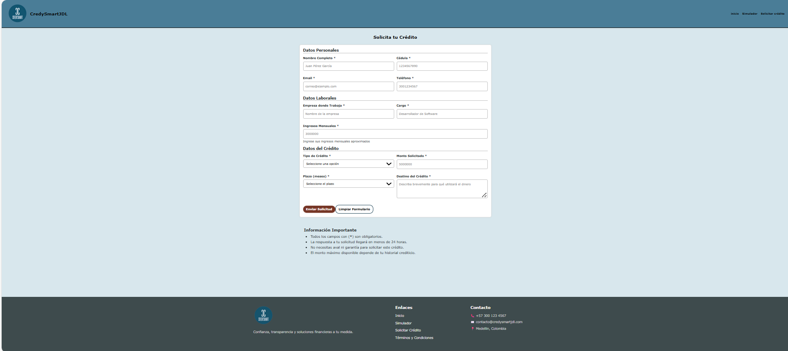
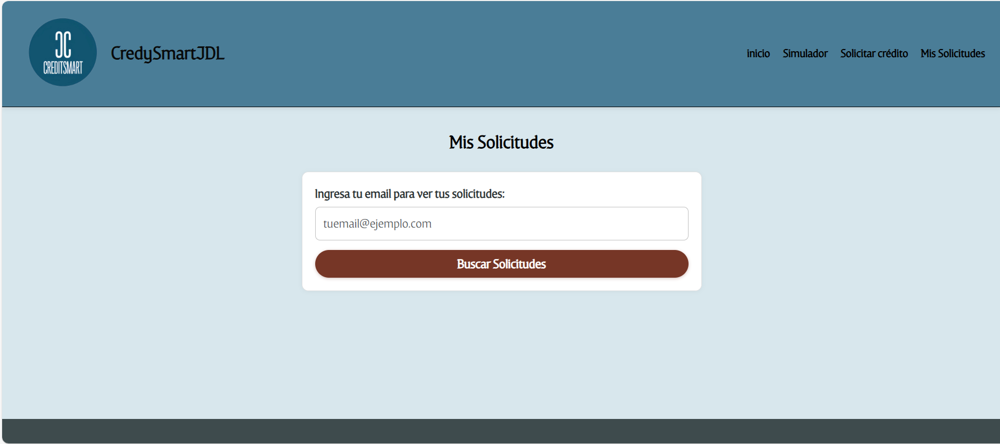
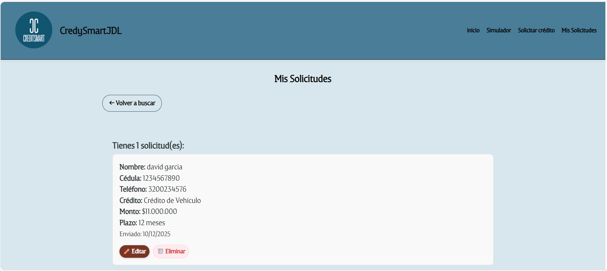

# CreditSmart - Integración con Firebase

Aplicación web para simulación y solicitud de créditos con persistencia en la nube usando **Firebase Firestore**.

## ✨ Funcionalidades
- Créditos cargados desde Firestore
- Simulador con filtros dinámicos (nombre, monto, tasa de interés)
- Solicitud de crédito guardada en la nube
- Consulta, edición y eliminación de solicitudes por email
- Cálculo en tiempo real de la cuota mensual
- Manejo de errores (funciona sin conexión a internet)

## 🛠️ Tecnologías
- React + Vite
- Firebase (Firestore)
- Bootstrap 5
- SweetAlert2

## 🚀 Configuración
1. Clonar el repositorio:
   ```bash
   git clone https://github.com/tu-usuario/credysmart-jdl.git

  2. **Instala las dependencias:**
     ```bash
     npm install
     ```

  3. **Inicia el servidor de desarrollo:**
     ```bash
     npm run dev
     ```

     > Esto iniciará un servidor de desarrollo normalmente en el puerto 5173.

## Capturas de pantalla
####  Página principal (index.html)


####  Página de búsqueda (Simulador.html)


####  Página de solicitud (Solicitud.html)


####  Página de Mis solicitudes (MisSolicitudes.html)



